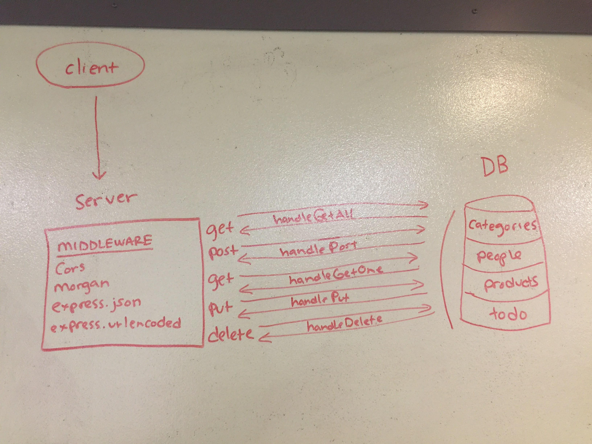

# LAB - 09

## API server

### Author: Adrienne Easton

### Links and Resources
* [submission PR](http://xyz.com)
* [travis]

#### Documentation
* [api docs](http://xyz.com) (API servers)
* [jsdoc](http://xyz.com) (Server assignments)
* [styleguide](http://xyz.com) (React assignments)

### Modules

#### Schemas

##### `categories-schema.js`
##### `people-schema.js`
##### `products-schema.js`
##### `todo-schema.js`

#### Models

##### `categories-model.js`
##### `people-model.js`
##### `products-model.js`
##### `todo-model.js`

#### Other

##### `v1.js`
##### `404.js`
##### `500.js`
##### `model-finder.js`
##### `memory.js`
##### `mongo.js`
##### `app.js`
##### `index.js`

### Setup
#### `.env` requirements
* `PORT` - mongodb://localhost:27017/class09
* `MONGODB_URI` - 3000

#### Running the app
* `npm start`
  
#### Tests
* `npm test`

#### UML

#### Swagger